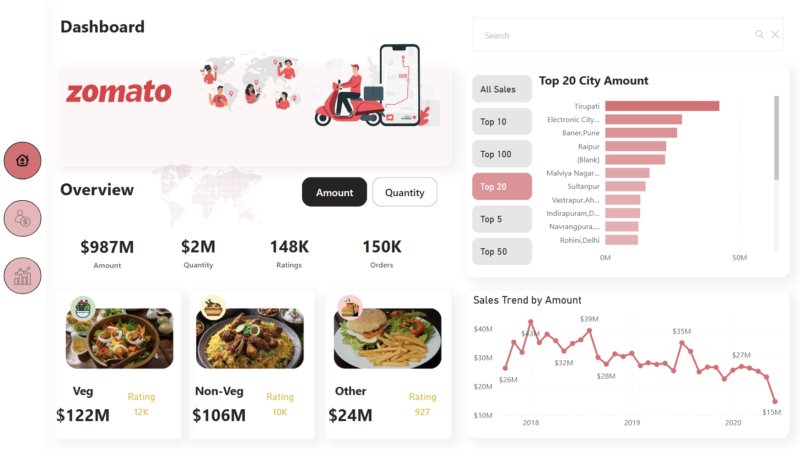
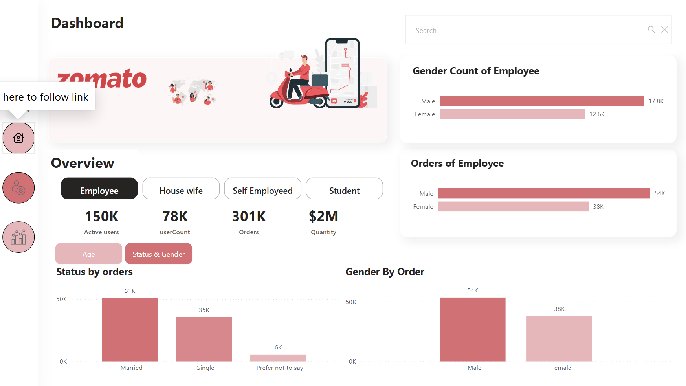
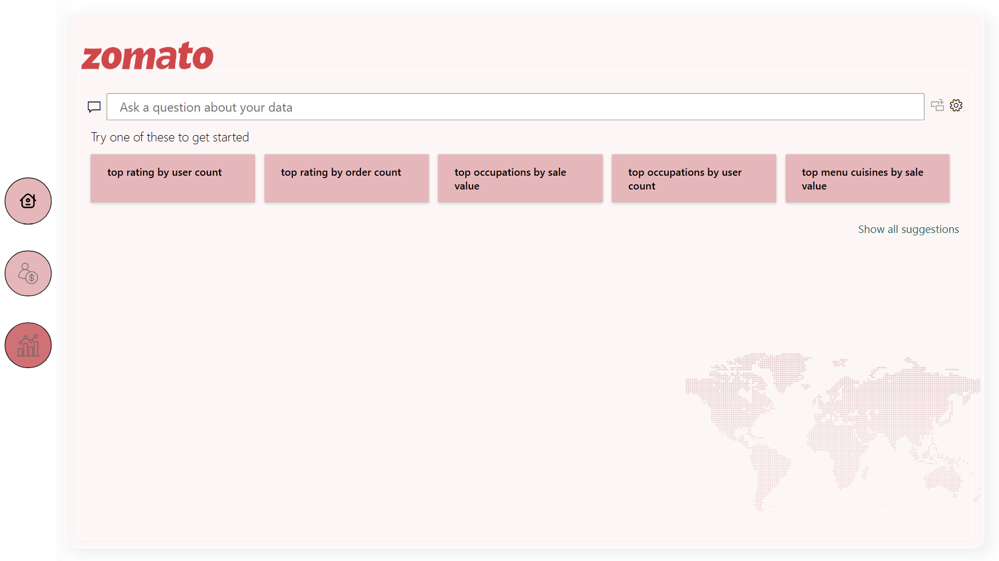

# Zomato Sales Dashboard Using Excel and Power BI

## Overview

This is an interactive, professionally designed sales dashboard built using Power BI and Excel. It provides deep insights into Zomato sales, user behavior, product performance, and demographic breakdowns using real-time visuals and rich data modeling techniques.

The project showcases advanced Power BI capabilities including:

* Data modeling
* Dynamic titles and metrics
* DAX measures
* Bookmarks and slicers
* Selection pane for seamless navigation
* Q\&A visual integration
* Custom visual styling

## 📸 Dashboard Screenshots

### 🔧 Data Model  

### 🏠 Home Page  

### 👥 User Insights  

### 💬 Q&A Interface  

## 📊 Dashboard Pages Breakdown

### 1. **Home Page (Home.png)**

* Displays high-level KPIs: Total Amount, Quantity Sold, Ratings, Total Orders.
* Toggle between "Amount" and "Quantity" using a button switch.
* Top cities bar chart dynamically filtered by slicer (Top 5, Top 10, etc.)
* Line chart showing sales trend over years.
* Segmented overview cards for Veg, Non-Veg, and Other menu types with value and ratings.
* Dynamic titles powered by DAX based on slicer selection.

### 2. **User Page (User.png)**

* Filter by user occupation: Employee, Housewife, Self-Employed, Student.
* Visuals include:

  * Gender breakdown bar chart.
  * Order count by gender.
  * Status (married/single) breakdown by order count.
* Utilizes bookmarks and buttons to toggle between different user segment views.

### 3. **Q\&A Page (Q\&A.png)**

* Integrates Power BI’s natural language Q\&A visual.
* Users can type questions like "top occupations by sale value" or "top menu cuisines by sale value".
* Predefined questions for quick insights using Q\&A tiles.

## 🧠 Data Model (Data Model.png)

* Fact Table:

  * `orders1`: Sales data with restaurant ID, user ID, price, order type, etc.
* Dimension Tables:

  * `restaurant`: Location and restaurant details.
  * `menu` and `food`: Product details including veg/non-veg flag.
  * `users1`: User demographics like gender, age, marital status, occupation.
  * `orderType`: Order channel/type.
  * `RankTable`: Helper table to dynamically filter Top N cities.
  * `Measure Table`: Centralized location of calculated DAX measures.

## 🧮 Key Features and Techniques Used

### ✅ Data Modeling

* Star schema layout with clear relationship paths.
* Directional filtering enabled selectively to ensure performance and correctness.

### ✅ DAX Measures

* Created reusable metrics like:

  * `SaleValue` = SUM(orders1\[Value])
  * `TopNsales` = RANKX based dynamic filtering by selected top-N.
  * `DynamicTitleGender`, `DynamicSalesTitle`, etc., to reflect slicer state in headings.

### ✅ Power Query (ETL)

* Data cleaned, renamed, and reshaped using Power Query.
* Applied column unpivoting to create dynamic slicers from wide-format metrics.

### ✅ Power Pivot

* Managed all relationships and measure calculations through data model interface.
* No calculated columns—purely measure-driven analysis for efficiency.

### ✅ Visual Design & Navigation

* Used **selection pane**, **bookmarks**, and **buttons** to switch pages and visuals.
* Custom visual formatting for brand consistency (Zomato theme).

### ✅ Slicers & Controls

* Metric selection slicer created using `Metrics` table.
* Top-N filtering slicer built using `RankTable` and dynamic filtering DAX.
* Occupation slicer filters demographic visuals on the user page.

### ✅ Power BI Service

* Report is published to Power BI Service and accessible at:
  [Live Dashboard Link](https://app.powerbi.com/groups/me/reports/1509a6d6-b4e0-4735-9697-22b2f716a362/945e2e03a23cd8696901?experience=power-bi&bookmarkGuid=b86a4a20120e93dc8458)

---

## 🛠️ Tools & Technologies

* **Microsoft Excel** (for initial data formatting)
* **Power BI Desktop** (data modeling, ETL, DAX, dashboarding)
* **Power Query** (data cleaning & transformations)
* **DAX** (dynamic calculations and logic)
* **Power BI Service** (report publishing & Q\&A)

## 📌 Project Highlights

* Professional design tailored to Zomato branding.
* Fully interactive dashboard with dynamic metrics.
* Clean, optimized data model using best practices.
* Dynamic page titles and visuals powered by slicers and DAX.
* End-to-end BI workflow from raw data to published report.

---

### 🚀 To View The Dashboard

[Click here to open live Power BI report](https://app.powerbi.com/groups/me/reports/1509a6d6-b4e0-4735-9697-22b2f716a362/945e2e03a23cd8696901?experience=power-bi&bookmarkGuid=b86a4a20120e93dc8458)

Feel free to fork the repo or reach out if you'd like to collaborate on similar analytics projects!
